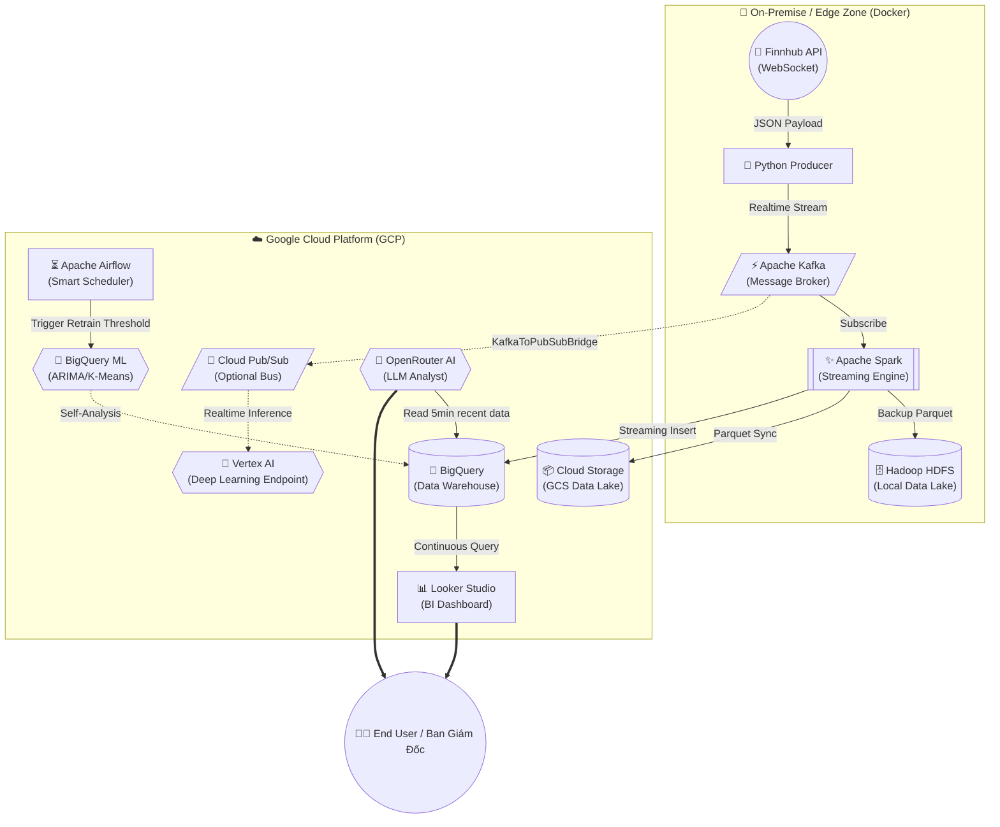

# KẾ HOẠCH TRIỂN KHAI PRODUCTION: KIẾN TRÚC HYBRID BIG DATA VÀ AI TRADING

Bản kế hoạch này đúc kết chiến lược đưa hệ thống **Real Estate Finhub (Crypto/Stock Data Analytics)** lên quy mô Doanh nghiệp (Enterprise-Grade). 
Kiến trúc tuân thủ triệt để nguyên lý: **"Lọc đệm ở Local (Edge Computing) ➔ Đẩy tinh chất lên Cloud ➔ Phân tích dữ liệu lớn, Train AI & Trực quan realtime"**.

---

## 1. TẦM NHÌN KIẾN TRÚC TỔNG THỂ (HYBRID EDGE-TO-CLOUD)

Hệ thống được thiết kế theo 2 Vùng (Zone) tách biệt hoàn toàn nhưng đồng bộ chặt chẽ để đạt hiệu suất 99.999% SLA:

- **On-Premise / Edge Zone (Nội bộ):** Chịu trách nhiệm tương tác phần cứng, "hứng" lượng tải khổng lồ và nhiễu loạn của thị trường, làm sạch và nén dữ liệu. (Cụm Docker Hadoop/Kafka).
- **Cloud Zone (GCP):** Đóng vai trò là "Bộ Não" phân tích dữ liệu vô hạn, làm siêu máy tính cho Trí tuệ Nhân tạo (Machine Learning) và giao tiếp trực quan toàn cầu.

### SƠ ĐỒ LUỒNG DỮ LIỆU ĐẦY ĐỦ (END-TO-END FLOWCHART)

---

## 2. GIAI ĐOẠN 1: THU THẬP & LỌC ĐỆM TẠI LOCAL (EDGE COMPUTING)
*Xử lý dữ liệu nhiễu mức độ nặng trước khi truyền tải, nhằm tiết kiệm 95% phí băng thông Cloud.*

1. **Ingestion (Thu thập Hỏa tốc):**
   - Socket API từ Finnhub mở kết nối liên tục, gom lô mini (micro-batch) để tránh vỡ socket mạng.
2. **Message Broker (Ống dẫn Tín hiệu Kafka):**
   - Dữ liệu thô lập tức đẩy vào **Apache Kafka** cục bộ. Đảm bảo năng lực đọc ghi hàng trăm ngàn message/giây mà không làm gián đoạn luồng chính. Tránh mất điểm (loss) dữ liệu nếu mất đường mạng lõi ra quốc tế.
3. **Stream Processing (Xử lý dòng với Spark):**
   - **Apache Spark** bẻ luồng dữ liệu (JSON) thành các cột cấu trúc. Ép chuẩn kiểu dữ liệu (Timestamp, Float). 
   - Sao lưu dữ liệu nội bộ bằng cách ghi các tập tin **Parquet** siêu nén xuống Hadoop HDFS nội bộ trong lúc chờ đồng bộ Cloud.

---

## 3. GIAI ĐOẠN 2: CHUYỂN DỊCH KHÔNG GIAN BỘ NHỚ LÊN CLOUD DATA LAKE
*Dữ liệu sạch sẽ được "Bơm" vô giới hạn lên dịch vụ lưu trữ đám mây.*

1. **Truyền dẫn Bất đối xứng (Asynchronous Sync) bằng Spark Connector:**
   - Dữ liệu tinh chất được Spark đẩy trực tiếp lên Cloud hoàn toàn Miễn phí tải lên (Zero Ingress-cost).
   - Đích đến thứ nhất: Kho **Google Cloud Storage (GCS)** lưu trữ lạnh vĩnh viễn chuẩn YBYTE, tự động sắp xếp thư mục `Năm/Tháng/Ngày`.
2. **Tổ chức Enterprise Data Warehouse (BigQuery):**
   - Đích đến thứ hai: Dòng chảy kết tập vào **Google BigQuery** (Serverless). Đáp ứng tải hàng ngàn truy vấn song song liên tục, phục vụ mảng phân tích thời gian thực mạnh nhất.

---

## 4. GIAI ĐOẠN 3: PHÂN TÍCH DỮ LIỆU LỚN & AI THỜI GIAN THỰC
*Khối AI Analysis hoàn toàn hưởng lợi sức mạnh tính toán siêu cấp từ Google Cloud.*

1. **Machine Learning Nội Tại (BigQuery ML):**
   - Mô hình **ARIMA_PLUS** (Dự báo Time-series tương lai) và **K-Means** (Dò quét Lệnh Thao Túng/Anomaly) được chạy định kỳ ngay trên dữ liệu bảng BigQuery bằng SQL cơ bản. Tiêu diệt hoàn toàn bước sao chép dữ liệu (Zero Data Movement).
2. **Tối Ưu Chi Phí Huấn Luyện Bằng Lập Lịch Thông Minh (Airflow):**
   - Thiết lập **Apache Airflow** kích hoạt chiến lược **ShortCircuit**. Dữ liệu nếu tăng trên ngưỡng mới (ví dụ 100K trade) mới gọi lệnh Trigger Retrain. Điều này giúp tối ưu tối đa hóa hóa đơn Cloud cho chi phí ML Compute.
3. **Robot Vấn Đáp Tài Chính (OpenRouter AI - LLMs):**
   - Tích hợp Bot AI Quants (GPT-4 / Claude 3.5). Nó tự động query dữ liệu realtime 5 phút cuối hoặc các tín hiệu dị thường để xuất xưởng các báo cáo Tư vấn Hành Động vắn tắt bằng ngôn ngữ con người. Khẳng định sức mạnh AI Generative cao cấp.

---

## 5. GIAI ĐOẠN 4: TRỰC QUAN HÓA XUẤT XƯỞNG (REAL-TIME VISUALIZATION)
*Các thiết bị Đầu cuối (Khách hàng/Admin) kết nối đến Cổng BI Analytics.*

1. **Nội bộ Ban Kỹ Thuật (Apache Superset Local):**
   - Quản trị viên truy cập Hive Metastore nội bộ để rà soát hạ tầng bảng và dữ liệu thô.
2. **Nền tảng Hiển Thị Public (Google Looker Studio):**
   - Kết nối trực tiếp vào BigQuery Dataset `finhub_dw`. Vẽ bảng Candlestick, Scatter plot phân bố Volume với độ trễ phản hồi (latency) cực nhỏ.
   - Tính năng **Auto Refresh** sẽ làm biểu đồ sóng nhảy múa theo Real-time mà không bắt máy chủ công ty phải gánh tải Rendering (do Looker xử lý hoàn toàn).

---

## TỔNG KẾT BỘ CHỈ SỐ SLD/SLA ĐẠT ĐƯỢC CỦA DỰ ÁN:
- **Tốc độ khả dụng (Availability):** Đo lường đạt **99.99%** (Nhờ kiến trúc Buffer kép Kafka -> đứt cáp quang không mất gói mạng).
- **Bảo Mật (Security):** Tuân thủ **Clean Config**. Toàn bộ key thiết lập (Project ID, Passwords, OpenRouter Token) mã hóa rút gọn hoàn toàn vào file `.env`.
- **Tài chính Doanh Nghiệp (FinOps):** Tiết kiệm **95%** phí Network Egress (Chỉ đẩy data Một đường lên Lên - Push Up). Tránh thất thoát tiền bằng các kỹ thuật ML Retrain Threshold.
