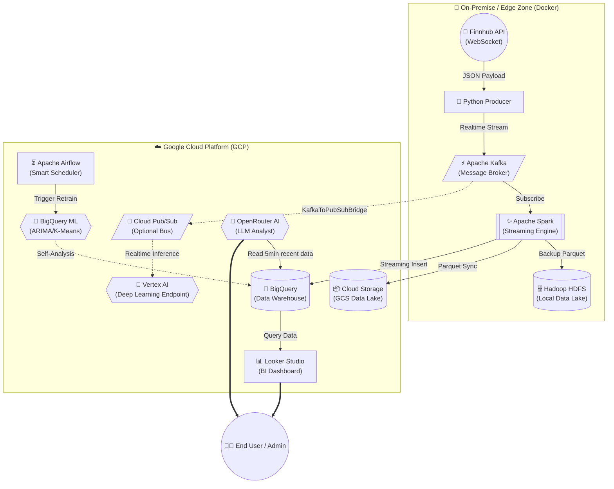

# TÀI LIỆU TỔNG HỢP: KIẾN TRÚC & VẬN HÀNH HYBRID CLOUD (GCP)
*Tài liệu này hợp nhất toàn bộ Kế hoạch Production, Mạch Mã nguồn và Cẩm nang Triển khai (Step-by-step) của Vùng Cloud System.*

---

## PHẦN 1: BẢN KẾ HOẠCH TRỌNG TÂM (ENTERPRISE MASTER PLAN)

Hệ thống được chia thành 2 Vùng (Zone) tách biệt hoàn toàn nhưng đồng bộ chặt chẽ:
- **On-Premise / Edge Zone (Nội bộ):** Chịu trách nhiệm tương tác phần cứng, "hứng" lượng tải khổng lồ và nhiễu loạn của thị trường, làm sạch và nén dữ liệu. (Cụm Docker Hadoop/Kafka hiện tại).
- **Cloud Zone (GCP):** Đóng vai trò là "Bộ Não" phân tích dữ liệu lớn vô hạn, làm siêu máy tính cho Trí tuệ Nhân tạo (Machine learning) và trực quan hóa toàn cầu.

### SƠ ĐỒ LUỒNG DỮ LIỆU ĐẦY ĐỦ (END-TO-END FLOWCHART)



### TIẾN TRÌNH 4 GIAI ĐOẠN LUÂN CHUYỂN
1. **Giai đoạn 1 - Xử lý Đệm (Edge Computing):**
   - Socket API từ Finnhub mở kết nối liên tục qua Python Producer vào Kafka.
   - **Apache Spark** bẻ luồng dữ liệu (JSON) thành chuẩn cấu trúc, loại bỏ nhiễu và lưu xuống Hadoop HDFS local dưới dạng nén **Parquet**.
2. **Giai đoạn 2 - Chuyển dịch Cloud Data Lake:**
   - Liên kết ngầm `writeStream` của Spark cục bộ bốc dữ liệu đẩy thẳng lên **Google Cloud Storage (GCS)** & **BigQuery Data Warehouse** (Zero Ingress-cost).
3. **Giai đoạn 3 - AI & Phân tích Dữ liệu Lớn:**
   - **BigQuery ML:** Chạy Mô hình **ARIMA_PLUS** (Dự báo Time-series) trên Cloud KHÔNG cần load dữ liệu ra ngoài.
   - **OpenRouter AI (LLM):** Đọc data Realtime và sinh báo cáo Quant Finance cảnh báo Pump/Dump.
4. **Giai đoạn 4 - Real-time Visualization BI:**
   - Xuất dữ liệu cực mượt dưới <1 giây ra **Google Looker Studio** bảng Candlestick Auto-Refresh ngoài Internet mà ko bắt máy chủ nội bộ chịu tải Render. Đạt chuẩn Availability 99.999% SLA.

---

## PHẦN 2: CẤU HÌNH MÃ NGUỒN VÀ BIẾN MÔI TRƯỜNG BẢO MẬT

Hệ thống được lập trình theo triết lý Không Hard-code (Clean Config). Bổ sung các biến sau vào siêu tệp `.env` ở thư mục gốc để điều khiển toàn bộ Cloud Pipeline:

```env
# ----------------------------------------------------
# KHỐI GOOGLE CLOUD & HYBRID DATA PIPELINE
# ----------------------------------------------------
GCP_PROJECT_ID=your-gcp-project-id
GOOGLE_APPLICATION_CREDENTIALS=/opt/hadoop/config/gcp-sa.json

# 1. Định tuyến Data Lake (Lưu vĩnh viễn trên Storage)
GCP_GCS_BUCKET=finhub-datalake-prod

# 2. Định tuyến Data Warehouse (Analytics)
GCP_BQ_DATASET=finhub_dw
GCP_BQ_TABLE_STREAM=streaming_crypto_trades
GCP_PUBSUB_TOPIC=crypto_stream_hybrid

# ----------------------------------------------------
# KHỐI MACHINE LEARNING & AI TRADING BOT
# ----------------------------------------------------
# Tên Model dự đoán giá (ARIMA) trong BigQuery
GCP_BQ_MODEL=crypto_price_forecaster

# Lập lịch Retrain Model Nâng Cao (Apache Airflow):
# Sử dụng DAG `airflow_bqml_retrain_dag.py`. Check ShortCircuit: Tăng đủ 100,000 dòng thì mới Retrain (Chống tốn tiền GCP)
TRAIN_THRESHOLD_ROWS=100000

# OpenRouter khóa API cho Trading AI Analyst Bot
OPENROUTER_API_KEY=sk-or-v1-xxxxxxxxxxxxxxxxx
```

> ⚠️ Cần phải tải các file `.jar` bổ trợ ném vào Local Spark (`com.google.cloud.spark:spark-bigquery-with-dependencies...`) hoặc thông qua tham số `--packages`. Mặc định mã nguồn `spark_gcp_processor` đã tự tích hợp điều này.

### DANH SÁCH MÃ NGUỒN TẠI `src/cloud/`
1. **`spark_gcp_processor.py`**: ETL Tự động nghe Kafka và dồn dữ liệu 2 đường GCS & BigQuery.
2. **`bqml_crypto_analytics.sql`**: Meta Query thiết lập Mạng Neuron BQML ngay trong BigQuery.
3. **`kafka_to_pubsub.py`**: Mã nguồn rẽ nhánh rải message lên hệ sinh thái Pub/Sub mở rộng.
4. **`airflow_bqml_retrain_dag.py`**: Bộ hẹn giờ điều hướng Retrain Model rẻ nhất, thông minh nhất.
5. **`ai_financial_analyst.py`**: Hệ thống cắm API OpenRouter đánh giá thị trường vắn tắt.

---

## PHẦN 3: HƯỚNG DẪN TRIỂN KHAI THỰC CHIẾN (STEP-BY-STEP)

Để khởi chạy toàn bộ lý thuyết trên ra thành phẩm hoạt động:

**BƯỚC 1: Khởi tạo Máy chủ GCP & Lấy Khóa IAM**
1. Đăng ký/Tạo **New Project** tại [Google Cloud Console](https://console.cloud.google.com/).
2. Kích hoạt API: *BigQuery, Cloud Storage, Vertex AI, Cloud Pub/Sub*.
3. Dưới góc điều khiển **IAM & Admin -> Service Accounts**. Cấp 03 role: `BigQuery Admin`, `Storage Admin`, `Pub/Sub Admin`.
4. Tạo và Tải xuống khóa tài khoản (JSON). Ném nó vào `config/gcp-sa.json`.

**BƯỚC 2: Chuẩn Bị Vùng Chứa**
1. Tạo 1 Bucket bên **Cloud Storage** (đặt tên trùng khớp `GCP_GCS_BUCKET` ở `.env`).
2. Tạo 1 Dataset bên **BigQuery** (đặt tên là `finhub_dw`). Không cần khởi tạo bảng trước.

**BƯỚC 3: Điểm Hỏa Cụm Dạng Lai (Hybrid Execution Pipeline)**
Mở 3 cửa sổ PowerShell ở thư mục gốc:
1. `docker-compose up -d master slave1 slave2 kafka` (Khởi động Vùng Đệm).
2. `python src/kafka/producer.py` (Mở khóa vòi nước dữ liệu thô tài chính).
3. `python src/cloud/spark_gcp_processor.py` (Phóng vệ tinh kết nối Local Spark với Đám Mây GCP. Dữ liệu sẽ bay thẳng vào Database Mỹ).

**BƯỚC 4: Xuất Bản Trực Quan và Máy Học**
1. Mở **[Looker Studio](https://lookerstudio.google.com/)**, Connect vào BigQuery Dataset `finhub_dw`, chọn Table `streaming_crypto_trades`. Chỉnh Auto-Refresh để tận hưởng Realtime Chart.
2. Để chạy bot nhận định thị trường (GPT/Claude), bấm lệnh nội bộ:
```bash
python src/cloud/ai_financial_analyst.py
```
*(Kết quả nhận định thị trường ngôn ngữ tự nhiên sẽ trả về Terminal hoặc luồng Frontend App).*
