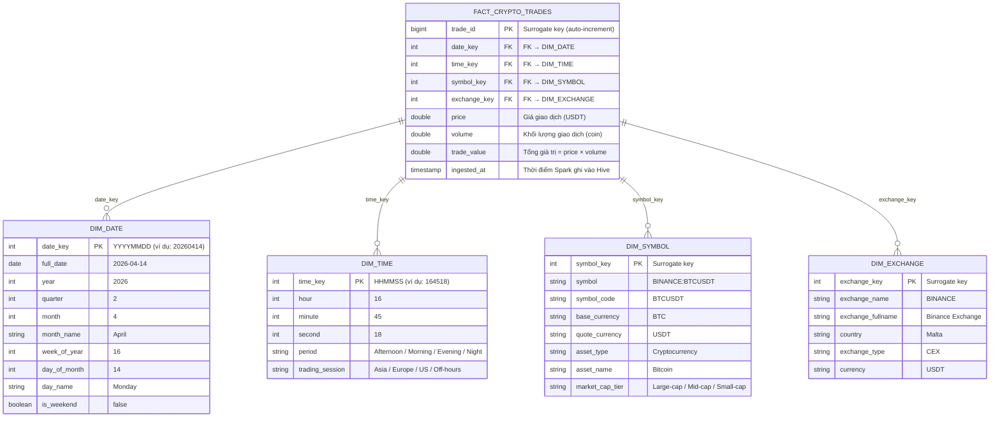
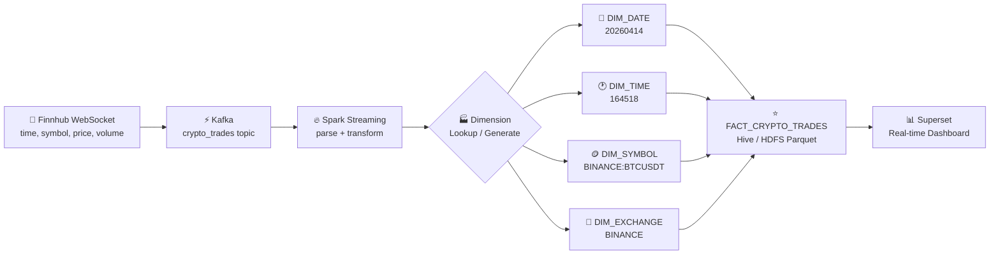

# Mô Hình Dim/Fact — Finhub Crypto Real-Time Pipeline

> Mô hình Star Schema thiết kế cho dữ liệu crypto streaming từ Finnhub (Binance).  
> Nguồn dữ liệu: `time`, `symbol` (BINANCE:BTCUSDT/ETHUSDT/BNBUSDT), `price`, `volume`

---

## Sơ Đồ ER (Star Schema)



---

## Luồng Dữ Liệu Vào Mô Hình



---

## Mapping Dữ Liệu Thực Tế → Mô Hình

| Trường gốc (CSV/Kafka) | Đích trong mô hình | Ghi chú |
|---|---|---|
| `time` = `2026-03-25 16:45:18` | `DIM_DATE.date_key = 20260325` | Extract ngày |
| `time` = `2026-03-25 16:45:18` | `DIM_TIME.time_key = 164518` | Extract giờ:phút:giây |
| `symbol` = `BINANCE:BTCUSDT` | `DIM_EXCHANGE.exchange_name = BINANCE` | Split by `:` |
| `symbol` = `BINANCE:BTCUSDT` | `DIM_SYMBOL.symbol_code = BTCUSDT` | Split by `:` |
| `symbol` = `BINANCE:BTCUSDT` | `DIM_SYMBOL.base_currency = BTC` | Split USDT |
| `price` = `71263.02` | `FACT.price = 71263.02` | Trực tiếp |
| `volume` = `0.002` | `FACT.volume = 0.002` | Trực tiếp |
| `price × volume` | `FACT.trade_value = 142.53` | Tính khi Spark transform |

---

## Các Query Phân Tích Điển Hình (Superset)

```sql
-- 1. Giá trung bình theo giờ từng đồng tiền
SELECT d.full_date, t.hour, s.symbol_code,
       AVG(f.price) as avg_price,
       SUM(f.trade_value) as total_value
FROM fact_crypto_trades f
JOIN dim_date d ON f.date_key = d.date_key
JOIN dim_time t ON f.time_key = t.time_key
JOIN dim_symbol s ON f.symbol_key = s.symbol_key
GROUP BY d.full_date, t.hour, s.symbol_code;

-- 2. Volume giao dịch theo phiên (Asia/Europe/US)
SELECT t.trading_session, s.symbol_code,
       SUM(f.volume) as total_volume,
       SUM(f.trade_value) as total_usd_value
FROM fact_crypto_trades f
JOIN dim_time t ON f.time_key = t.time_key
JOIN dim_symbol s ON f.symbol_key = s.symbol_key
GROUP BY t.trading_session, s.symbol_code;

-- 3. So sánh BTC vs ETH vs BNB theo ngày
SELECT d.full_date, s.asset_name,
       MIN(f.price) as low,
       MAX(f.price) as high,
       AVG(f.price) as avg_price
FROM fact_crypto_trades f
JOIN dim_date d ON f.date_key = d.date_key
JOIN dim_symbol s ON f.symbol_key = s.symbol_key
GROUP BY d.full_date, s.asset_name;
```

---

## Hiện Tại vs Tương Lai

| | Hiện tại (Flat Table) | Sau nâng cấp (Star Schema) |
|---|---|---|
| **Bảng** | `crypto_trades` (1 bảng) | `fact_crypto_trades` + 4 dim |
| **Phân tích theo ngày/giờ** | Phải parse string mỗi lần | Dùng dim_date, dim_time sẵn |
| **Lọc theo đồng tiền** | WHERE symbol LIKE 'BINANCE:BTC%' | JOIN dim_symbol đơn giản |
| **Tính trade_value** | Phải tính trong mỗi query | Đã tính sẵn trong fact |
| **Performance** | Scan toàn bảng | Partition by date_key |
